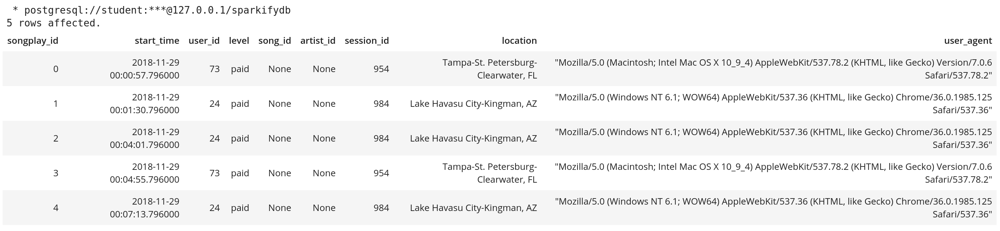
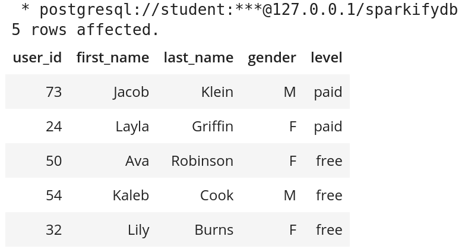
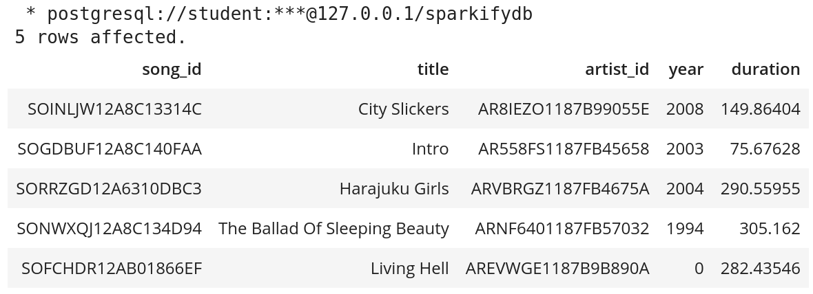
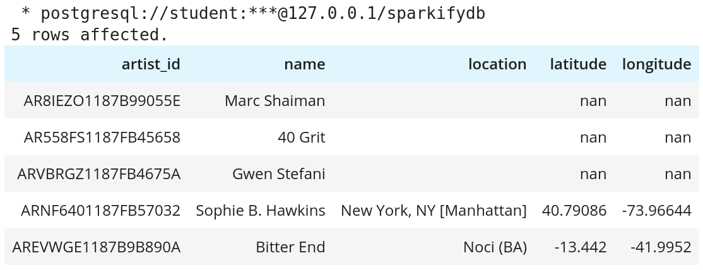
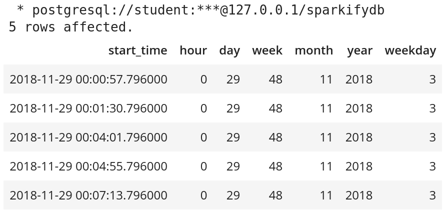

# Data Modeling with Posgres

## Introduction

A startup called Sparkify has been collecting on songs and user activity on their new music streaming app. Currently they have a directory of JSON logs on user activity, as well as a directory with JSON metadata on the songs in their app. Sparkify's analytics team is particularly interested in understanding what songs users are listening to. The task will be to create a Postgres database with tables designed to optimize queries on song play analysis. This includes creating a database schema and ETL pipeline.

## JSON Data

There are two directories of JSON files. 

**song_data**: JSON files in this directory contain song metadata. An example of an entry in one of the JSON file.

```
{"artist_id": "AR8IEZO1187B99055E", "artist_latitude": NaN, "artist_location": , "artist_longitude": NaN, "artist_name": "Marc Shaiman", "duration": 149.86404, "num_songs": 1, "song_id": "SOINLJW12A8C13314C", "title": "City Slickers", "year": 2008}
```

**log_data**: JSON files in this directory contain logs on user activity. An example of an entry in one of the JSON file.

```
{"artist": "Sydney Youngblood", "auth": "Logged In", "firstName": "Jacob", "gender": "M", "itemInSession": 53, ""lastName: "Klein", "length": 238.07955, "level": "paid", "location": "Tampa-St. Petersburg-Clearwater, FL", "method": "PUT", "page": "NextSong", "registration": 1.540558e+12, "sessionId": 954, "song": Ain't No Sunshine, "status": 200, "ts": 1543449657796, "userAgent": "Mozilla/5.0 (Macintosh; Intel Mac OS X 10_9_4...", "userId": 73}
```

## Database Schema

The Star schema is used for this project. There are several benefits for using the Star schema. These includes having denormalize tables, simplified queries, and fast aggregation of the data. The Star schema is usually less ideal for handling one-to-many or many-to-many relationships between the tables. Hence, the following tables are created to have only one-to-one relationships.


Fact Table

songplays - records in log data associated with song plays i.e. records with page NextSong
* songplay_id (int) Primary Key : ID for each songplay
* start_time (timestamp) : Start time of songplay session
* user_id (int) : User's ID
* level (varchar) : User's membership level {free | paid}
* song_id (varchar) : Song's ID
* artist_id (varchar) : Artist's ID
* session_id (int) : ID of user's current session
* location (varchar) : User's location
* user_agent (varchar) : User's software agent

Dimension Tables

users - users in the app
* user_id (int) : ID of user
* first_name (varchar) : User's first name
* last_name (varchar) : User's last name
* gender (varchar) : User's gender
* level (varchar) : User membership level {free | paid}

songs - songs in music database
* song_id (varchar) : Song's ID
* title (varchar) : Song's title
* artist_id (varchar) : Artist's ID
* year (int) : Year of song release
* duration (float) : Duration of song

artists - artists in music database
* artist_id (varchar) : Artist's ID
* name (varchar) : Artist's name
* location (varchar) : Artist's location
* latitude (float) : Latitude of artist's location
* longitude (float) : Longitude of artist's location

time - timestamps of records in songplays broken down into specific units
* start_time (timestamp) : Starting timestamp for songplay
* hour (int) : The hour of the songplay's start
* day (int) : The day of the songplay's start
* week (int) : The week of the songplay's start
* month (int) : The month of the songplay's start
* year (int) : The year of the songplay's start
* weekday (int) : The day of the week of the songplay's start

## ETL Pipeline

The ETL pipeline is contained in the script etl.py. The following steps will be performed when the ETL pipeline is run:
1. Create a connection to the database.
2. Retrieve all JSON files under the `data/song_data` directory.
3. Insert relevant data into the `songs` and `artists` SQL tables.
4. Retrieve all JSON files under the `data/log_data` directory.
5. Insert relevant data into the `time` and `users` SQL tables.
6. Insert relevant data into into the `songplays` SQL Fact Table. This step involves retrieving information from `songs` and `artists` table, besides the JSON files under the `data/log_data` directory.

## How to Run
1. Run `create_tables.py` to create the database and tables. In the main directory, run the following line in the terminal:
```
python create_tables.py
```
2. Run `etl.py` to insert data into the tables.In the main directory, run the following line in the terminal:
```
python etl.py
```
3. Run `test.ipynb` to confirm the creation of your tables with the correct columns. Make sure to click "Restart kernel" to close the connection to the database after running this notebook.

## Examples of Queries

```
%sql SELECT * FROM songplays LIMIT 5;
```



```
%sql SELECT * FROM users LIMIT 5;
```



```
%sql SELECT * FROM songs LIMIT 5;
```



```
%sql SELECT * FROM artists LIMIT 5;
```



```
%sql SELECT * FROM time LIMIT 5;
```


