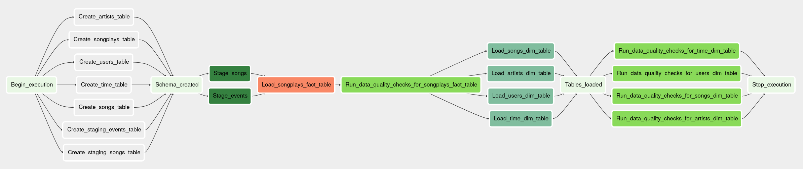
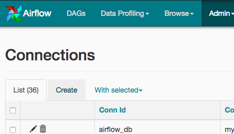
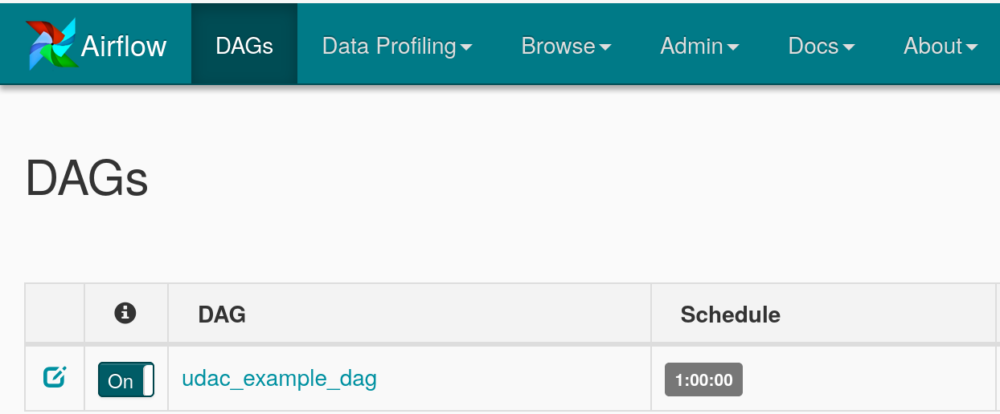

# Data Pipelines

## Introduction

A music streaming company, Sparkify, has decided that it is time to introduce more automation and monitoring to their data warehouse ETL pipelines and come to the conclusion that the best tool to achieve this is Apache Airflow.

The task will be to build data pipelines that are dynamic and built from reusable tasks, can be monitored, and allow easy backfills. In addition, checks will be implemented to catch any discrepancies in the datasets after the ETL steps are completed.

The source data resides in S3 and needs to be processed in Sparkify's data warehouse in Amazon Redshift. The source datasets consist of JSON logs that tell about user activity in the application and JSON metadata about the songs the users listen to.

## ETL Pipeline

* The `Begin execution` task marks the beginning of the ETL.
* The `Create staging events table` task creates the `staging events` SQL table on Redshift.
* The `Create staging songs table` task creates the `staging songs` SQL table on Redshift.
* The `Create songplays table` task creates the `songplays` SQL fact table on Redshift.
* The `Create artists table` task creates the `artists` SQL dimension table on Redshift.
* The `Create songs table` task creates the `songs` SQL dimension table on Redshift.
* The `Create users table` task creates the `users` SQL dimension table on Redshift.
* The `Create time table` task creates the `time` SQL dimension table on Redshift.
* The `Schema created` task indicates that all tables are created on Redshift.
* The `Stage events` task loads user activity logs from S3 into a staging table on Redshift.
* The `Stage songs` task loads songs metadata from S3 into a staging table on Redshift.
* The `Load songplays fact table` task loads data from the staging tables into the `songplay` fact table on Redshift.
* The `Run data quality checks for songplays fact table` task checks the data quality of the `songplay` fact table on Redshift.
* The `Load artists dim table` task loads data from the staging tables into the `artists` dimension table on Redshift.
* The `Load songs dim table` task loads data from the staging tables into the `songs` dimension table on Redshift.
* The `Load users dim table` task loads data from the staging tables into the `users` dimension table on Redshift.
* The `Load time dim table` task loads data from the staging tables into the `time` dimension table on Redshift.
* The `Tables loaded` task indicates that all tables have been loaded on Redshift.
* The `Run data quality checks for artists dim table` task checks the data quality of the `artists` dimension table on Redshift.
* The `Run data quality checks for songs dim table` task checks the data quality of the `songs` dimension table on Redshift.
* The `Run data quality checks for users dim table` task checks the data quality of the `users` dimension table on Redshift.
* The `Run data quality checks for time dim table` task checks the data quality of the `time` dimension table on Redshift.
* The `Stop execution` task indicates that the ETL is completed.

## How to Run (Udacity Workspace)
1. Create an AWS Redshift instance. These were the configurations used for testing the project.
  * Node type: dc2.large
  * Number of nodes: 4
  * Attach AmazonS3ReadOnlyAccess access to the IAM role for the cluster
  * Change publicly accessible setting in Redshift cluster to “Yes”
  * Add inbound rules for TCP inbound connection.
    * Go to the security group by clicking on link in the cluster description. Cluster security group will start with the name sg-*. 
    * Then go to the details of that particular security group and edit inbound rules. 
    * Add new entry with type as All TCP, protocol as TCP, port range 0 - 65535 and source as 0.0.0.0/0 or ::/0. 
    * Save the details. 
2. In Airflow's UI, configure your AWS credentials and connection to Redshift. Click on the Admin tab and select Connections.

3. Under Connections, select Create.

4. On the create connection page, enter the following values:
  * Conn Id: Enter aws_credentials.
  * Conn Type: Enter Amazon Web Services.
  * Login: Enter your Access key ID from the IAM User credentials you downloaded earlier.
  * Password: Enter your Secret access key from the IAM User credentials you downloaded earlier.
  

5. Once you've entered these values, select Save and Add Another.
6. On the next create connection page, enter the following values:
  * Conn Id: Enter redshift.
  * Conn Type: Enter Postgres.
  * Host: Enter the endpoint of your Redshift cluster, excluding the port at the end. You can find this by selecting your cluster in the Clusters page of the Amazon Redshift console. See where this is located in the screenshot below. IMPORTANT: Make sure to NOT include the port at the end of the Redshift endpoint string.
  * Schema: Enter dev. This is the Redshift database you want to connect to.
  * Login: Enter awsuser.
  * Password: Enter the password you created when launching your Redshift cluster.
  * Port: Enter 5439.
  

7. Once you've entered these values, select Save.
8. Start the DAG by switching it from OFF to ON.

9. Remember to delete your cluster each time you are finished working to avoid large, unexpected costs.