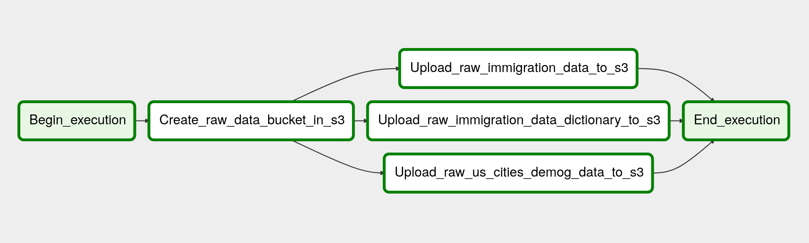
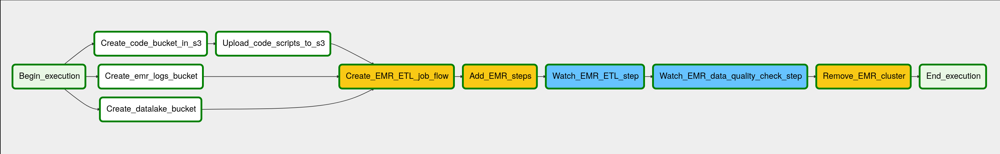
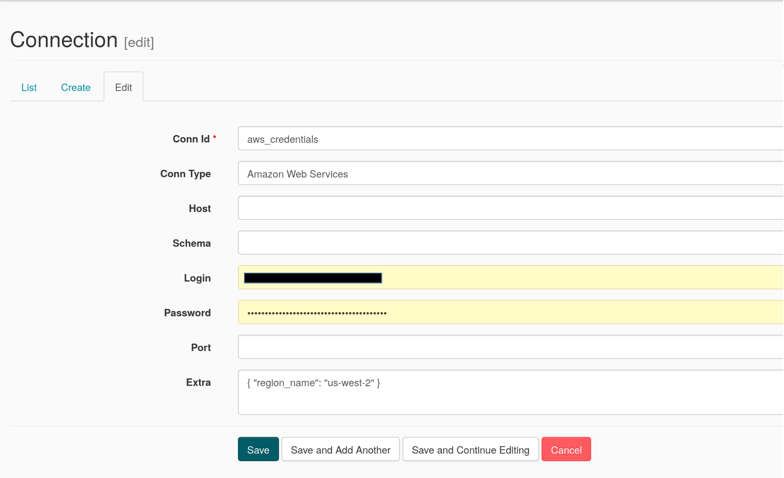

# Udacity Data Engineering Nanodegree Capstone Project: US Immigration Data Lake

This is my submission for the Udacity Data Engineering Nanodegree Capstone Project assignment. The project utilizes Apache Airflow to automate and monitor the data lake ETL.

There are 2 ETL DAGs for the project, both of which are managed by Airflow. The first DAG will orchastrate the upload of the source data from a local repository to S3. The second DAG orchastrates the data lake ETL pipeline, which will extract the data from S3, process them using Spark, and then load the transformed data back into S3 as a set of dimensional tables.


## Source Data

### 1. U.S. I94 Immigration Data 2016
This dataset was originally obtained from the [US National Tourism and Trade Office](https://travel.trade.gov/research/reports/i94/historical/2016.html). The data dictionary for this dataset can be found in the file `I94_SAS_Labels_Descriptions.SAS`. This dataset was provided in the Udacity workspace for students enrolled in the program.

### 2. U.S. City Demographic Data
This data comes from [OpenSoft](https://public.opendatasoft.com/explore/dataset/us-cities-demographics/export/).


## Data Model

The Star schema is used for this project. There are several benefits for using the Star schema. These includes having denormalize tables, simplified queries, and fast aggregation of the data. The Star schema is usually less ideal for handling one-to-many or many-to-many relationships between the tables. Hence, the following tables are created to have only one-to-one relationships.

### 1. Fact Table
Immigration
  - immigration_id: The unique ID for the respondent's immigration record. Primary key for this table. Foreign key for `visitor` and `trip_records` tables.
  - flight_number: The flight number of the respondent. Foreign key for `flight` table.
  - visa_type: The visa class of the respondent. Foreign key for `visa` table.
  - us_port_of_arrival_code: The US port of arrival code of the respondent. Foreign key for `us_cities_general_demog` table and `us_cities_race_demog` table

### 2. Dimension Tables

flight
  - flight_number: The flight number of the respondent. Primary key for this table.
  - airline: The airline taken by the respondent.

visitor
  - immigration_id: The unique ID for the respondent's immigration record. Primary key for this table.
  - birth_year: The birth year of the respondent.
  - occupation: The respondent's occupation in the US.
  - country_of_residence: The respondent's country of residence in the US.

trip_records
  - immigration_id: The unique ID for the respondent's immigration record. Primary key for the table.
  - arrival_date: The respondent's arrival date in the US.
  - year_of_arrival: The respondent's year of arrival in the US.
  - month_of_arrival: The respondent's month of arrival in the US.
  - country_of_prev_depart: The country the respondent departed berfore arriving in the US.
  - depart_date: The respondent's date of departure from the US.
  - date_of_file_entry: The date when the respondent's immigration files are added to the i94 files.
  - arrival_flag: A flag indicating the arrival of the respondent in the US.
  - departure_flag: A flag indicating the departure of the respondent in the US.
  - match_flag: A flag indicating a match in the respondent's arrival and departure records
  - last_permitted_day_of_stay: The respondent's last day of stay validity in the US.
  - state_of_visa_issued: The state where the visa is issued to the respondent.
  - _year: Partitioning column.
  - _month: Partitioning column.

visa: The visa information of the respondents.
  - visa_type: The respondent's visa class. A more granular visa classification such as Wt, B2, etc. Primary key for the table.
  - visa_category: The respondent's generic visa class (student, pleasure, business).

us_cities_general_demog: The general demographics data of US cities.
  - us_port_of_arrival_code: The US port of arrival code for the city. Primary key for this table.
  - city: The name of the US city
  - state: The state of the US city.
  - median_age: The median age of the US cities.
  - male_population: The male population of the US city.
  - female_population: The female population of the US city.
  - total_population: The total population of the US city.
  - number_of_veterans: The number of US veterans in the US city.
  - foreign-born: The number of foreignborn in the US city.
  - average_household_size: The average household size in the US city.
  - state_code: The state code.

us_cities_race_demog: The racial demographics data of US cities.
  - us_port_of_arrival_code: The US port of arrival code for the city. Primary key for this table.
  - race: The racial group.
  - count: The population count of the racial group


## Purpose of the Data Model

What's the goal? What queries will you want to run? How would Spark or Airflow be incorporated? Why did you choose the model you chose?

The goal of this data lake is to answer questions regarding immigration to the U.S. For example, users will be able to answer questions such as:

* Which are the top nationalities of visitors to the U.S.?
* What is the average duration of stay for visitors to the U.S.?
* Which are the most popular airlines taken by visitors to the U.S.?
* Which are the most popular seasons for the arrival of visitors to the U.S.?
* Are there any correlation between the demographics of U.S. cities and the number of visitors travelling there?

These are just some of the questions that can be answered with this database.

Both Spark and Airflow will be used to manage the data lake. Since the source dataset is relatively large (> 6 GB), and may not be able to fit onto a single computer, Spark is chosen for the ETL pipeline.

Airflow is an open-sourced DAG-based, schedulable, data-pipeline tool from Airbnb that can run in mission-critical environments. Airflow has the following features:
* A platform to programmatically author, schedule and monitor workflows. 
* Author workflows as directed acyclic graphs (DAGs) of tasks. 
* The airflow scheduler executes your tasks on an array of workers while following the specified dependencies. 
* Rich command line utilities make performing complex surgeries on DAGs a snap. 
* Has a user interface that makes it easy to visualize pipelines running in production, monitor progress, and troubleshoot issues when needed. 
* Enable workflows to be defined as code. Hence they become more maintainable, versionable, testable, and collaborative.

As such, Airfow will be used to schedule and maintain the ETL pipelines.


## ETL DAGs

### 1. Upload Raw Data to S3 DAG



This DAG is responsible for managing the upload of data from a local repository to an Amazon S3 bucket. This DAG is currently scheduled to run monthly at the start of every month.

### 2. Data Lake ETL DAG



This DAG is responsible for managing the ETL pipeline that will extract the source data from S3, transform them into a set of dimensional tables with AWS EMR, and then load the transformed tables back into S3. This DAG is currently scheduled to run monthly at the start of every month.


## How to Run

### Step 1: Download Docker Engine and Docker Compose or Download Docker Desktop

Docker Engine: https://docs.docker.com/engine/

Docker Compose: https://docs.docker.com/compose/

Docker Desktop: https://docs.docker.com/desktop/

### Step 2: Clone this repository

```
git clone https://github.com/joshxinjie/Data_Engineering_Nanodegree.git
```

### Step 3: Change into the `5_Capstone` directory and run the following command in the terminal to start the Airflow server.

```
docker-compose -f docker-compose-CeleryExecutor.yml up -d
```

### Step 4: Go to the followung URL.

```
http://localhost:8080/admin/
```

### Step 5: Add an Airflow Connection. 

Click on the Admin tab and select Connections.


Go to Connections, select Create.


On the create connection page, enter the following values:
* Conn Id: Enter aws_credentials.
* Conn Type: Enter Amazon Web Services.
* Login: Enter your Access key ID from your IAM User credentials.
* Password: Enter your Secret access key from your IAM User credentials.
* Extra: { "region_name": "us-west-2" } 



Once you've entered these values, select Save.

## Step 6: Prepare source dataset on your local computer.

Place the source data in your local repository according to this file structure.

```
5_Capstone
  |-- airflow
  |-- config
  |-- images
  |-- notebooks
  |-- script
  |-- src
  |-- raw_data
        |-- 18-83510-I94-Data-2016
              |-- i94_apr16_sub.sas7bdat
              |-- i94_aug16_sub.sas7bdat
              |-- ...
        |-- I94_SAS_Labels_Descriptions.SAS
        |-- us-cities-demographics.csv
  |-- docker-compose-CeleryExecutor.yml
  |-- Dockerfile
  |-- requirements.txt
  |-- README.md
```

## Step 7: Start the Upload Raw Data to S3 DAG by switching it from OFF to ON.

## Step 8: Start the Data lake ETL DAG by switching it from OFF to ON.

### Step 9: Run the following command in the termianl when you want to stop the Airflow server.

```
docker-compose -f docker-compose-CeleryExecutor.yml down
```


## Addressing Other Scenarios

### 1. If the data was increased by 100x.

Currently the Airflow server is run on a single container on a local server. If the data was increased by 100x, we may need to run our Airflow server on a cluster of machines. One option will be to host the Ariflow server on AWS EC2 instances.

The ETL pipeline is currently performed by AWS EMR service. Should the size the of data increase by 100x, we simply only need to increase the number of EMR nodes used to execute the pipeline.

Lastly, the S3 buckets can easily handle storage for extremely large datasets so the increase in the size of the data will not be an issue.

### 2. If the pipelines were run on a daily basis by 7am.

This can easily be addressed by scheduling the Airflow DAGs to run on a daily basis at 7 am. Currently, the DAGs are scheduled only to run once per month.

### 3. If the database needed to be accessed by 100+ people.

Users can use AWS services like AWS Athena to access the datalake. AWS Athena is serverless, so there is no infrastructure to manage, and it can easily support large number of users.
